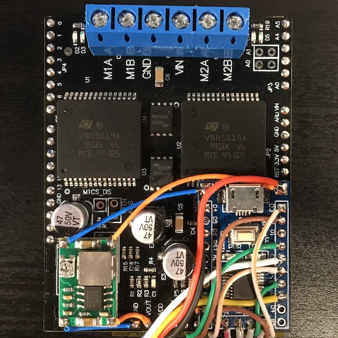
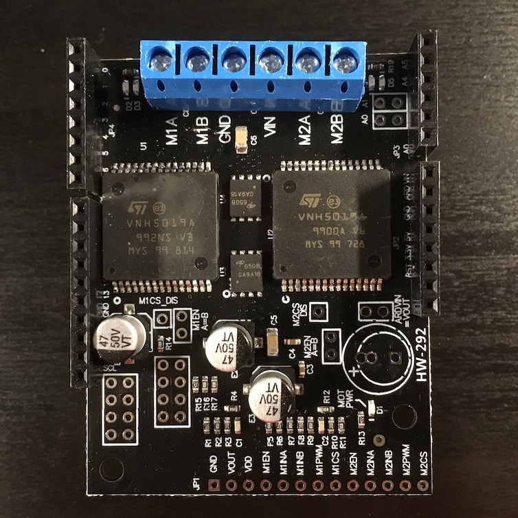
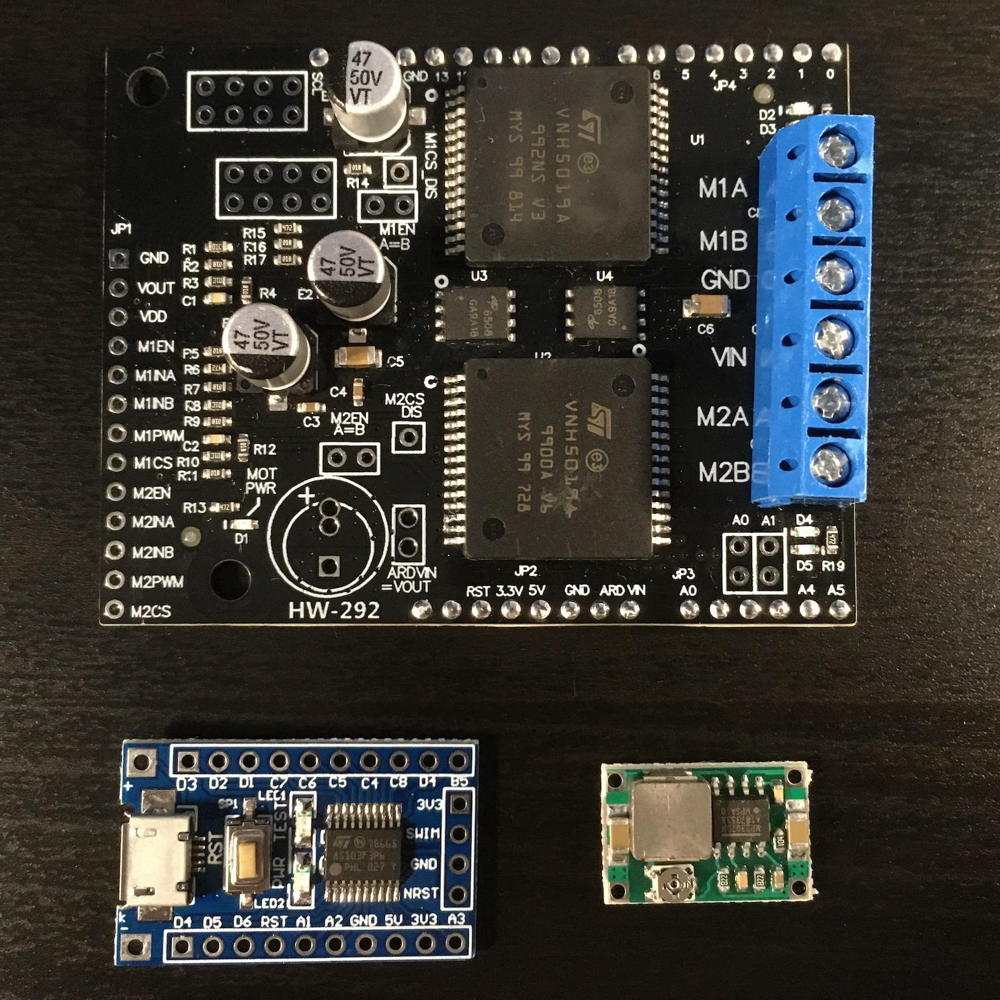
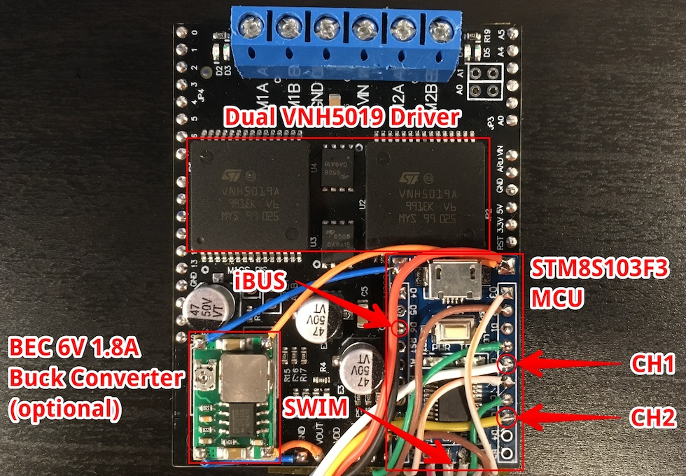
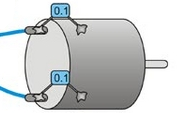

RC Dual Motor Driver firmware for STM8 MCUs
===========================================

This firmware turns an STM8 MCU into an RC (radio control) bidirectional dual motor driver:

* By default, RC channel 1 controls forward/reverse for both motors while RC channel 2 controls differential steering between them.
* In independent mode, RC channels 1 and 2 control the motors independently.
* iBUS servo interface can be used to connect to a FlySky receiver.
* Controls need to be returned to their initial positions (re-armed) on startup or signal loss.
* Status LED indicates how many RC channels are active by blinking that number of times.
* Watchdog resets the device in case of signal loss.

Supported MCUs
--------------

+ STM8S003xx
+ STM8S005xx
+ STM8S103xx
+ STM8S105xx

Dependencies
------------

+ cmake
+ sdcc
+ stm8flash

Installation
------------

Check out _#define_ statements at the beginning of _src/config.h_ to see if you need to change settings before building the firmware. Options to consider:

* The default PWM frequency is 16kHz at 8Mhz clock. It can be decreased by a multiple of 2 using the PWM_DIV value. It can also be doubled by switching to 16Mhz clock via the CLK_16MHZ option.

* The output pins can be inverted via the *_INV options.

* If iBUS is used, RC-to-RX channel mapping can be configured using the IBUS_CHx values.

To build, run (with your own MCU):

    cmake -B build -D MCU=STM8S103F3
	cd build
    make

To install on the device, run (with your own programmer):

	make PROG=stlinkv2 flash

Pinout
------

| Pin     | I/O | Description    |
|---------|-----|----------------|
| C1 (C6) | IN  | RC channel 1   |
| C3      | IN  | RC channel 2   |
| D6      | IN  | iBUS servo     |
| D4 (C5) | OUT | PWM 1          |
| D3      | OUT | PWM 2          |
| C7      | OUT | Forward 1      |
| C4      | OUT | Forward 2      |
| D2      | OUT | Reverse 1      |
| A3      | OUT | Reverse 2      |
| E5 (B5) | OUT | Status LED     |

Pins in brackets pertain to STM8Sx03Fx (20-pin) MCUs.

Building a dual 12A bidirectional ESC
-------------------------------------

If you are like me and have been looking for a reliable ESC (electronic speed controller) for your RC model, you might have already hit a snag with the glitchy and loud ESCs made by "Payne", whoever that is, that are sold for around $20-30 on eBay. All of them have the same inherent stability issue rendering them completely useless right out of the box (I checked six of them of different types). Or you might have already ended up buying a Sabertooth dual 12A motor driver for $65 or a similar relatively expensive controller. The good news is that you can actually build your own durable ultrasonic ESC for a fraction of that price:

Parts needed:

1. Dual VNH5019 motor driver
2. STM8S103F3 board
3. Step-down buck converter (optional)

Originally, the driver is made by Pololu, but... Come on, Pololu! $100 for a PCB with two ICs $8 each and a typical application circuit from the datasheet?! I ended up buying a clone for $25 on Amazon. The quality is not perfect. I had to solder through a couple of legs in order to remove tiny solder balls accumulated behind them. Anyways, it never hurts to check components before use, so it was hardly a big deal for me. The driver is sold as an Arduino shield:

To remove the Arduino headers, crush the plastic housing with a cutter and unsolder the rest:

Combine the parts together using a double-sided tape and make the following connections between the driver and the board:

| Driver | Board |
|--------|-------|
| GND    | -     |
| VOUT   | +     |
| VDD    | 3V3   |
| M1INA  | C7    |
| M1INB  | D2    |
| M1PWM  | C5    |
| M2INA  | C4    |
| M2INB  | A3    |
| M2PWM  | D3    |

Should an optional step-down buck converter be used, put it in between GND/- and VOUT/+. Otherwise, make sure input voltage never exceeds 15V, i.e. the maximum voltage the AMS1117 voltage regulator on the board can handle.

Solder signal leads, flash the MCU, and enjoy:

Protect the ESC from electrical noise coming from your motors by soldering one 0.1uF ceramic capacitor from each terminal to the motor case:

Choose your motor leads and power supply according to the maximum current the motors can draw. Insufficient current supply can cause profound voltage drop during rapid acceleration which may lead to sporadic MCU resets. It is also beneficial to make the leads as short as possible and twist them around each other.
